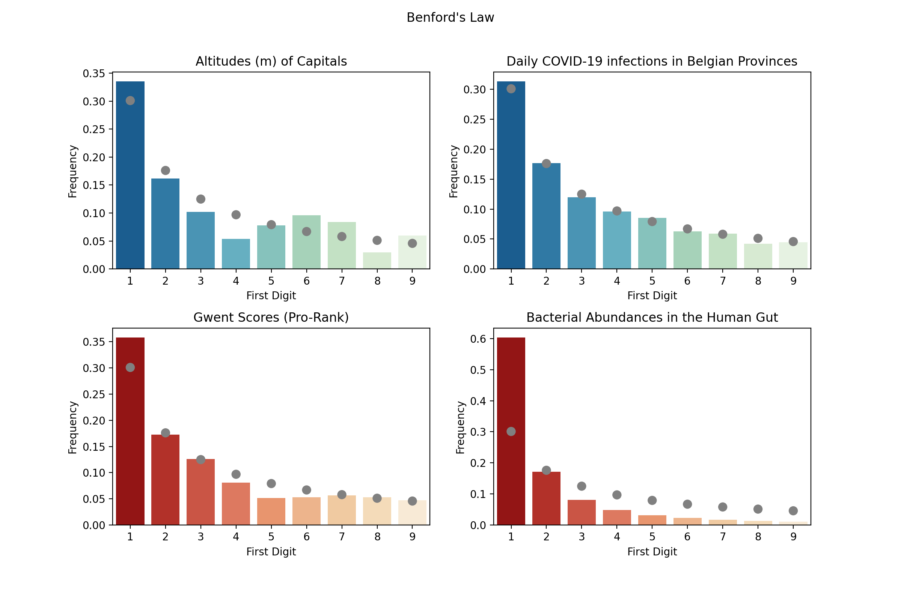

# Putting Benford's Law to the Test

After seeing the Episode on [Benford's Law](https://en.wikipedia.org/wiki/Benford%27s_law) in [Latif Nasser](https://twitter.com/latifnasser)'s 
[Connected](https://www.imdb.com/title/tt12753692/?ref_=fn_al_tt_2) (currently on Netflix), I had to test if this is true and if
I could find a few datasets where it applies. And ... I did! 

All the data and code I used is available in this repository, you can find the blog article here : [http://blog.4dcu.be/programming/2020/09/05/Testing-Benfords-Law.html](http://blog.4dcu.be/programming/2020/09/05/Testing-Benfords-Law.html)

# Results

I found Benford's law applies to the letter in two datasets I tested: Altitudes of Capitals and daily COVID-19 infections in Belgian Provinces. While they didn't match the hypothetical distribution, a similar non uniform distribution could also be seen in Gwent Pro-Ranked Player's scores and the bacterial abundances in the Human Gut. 

